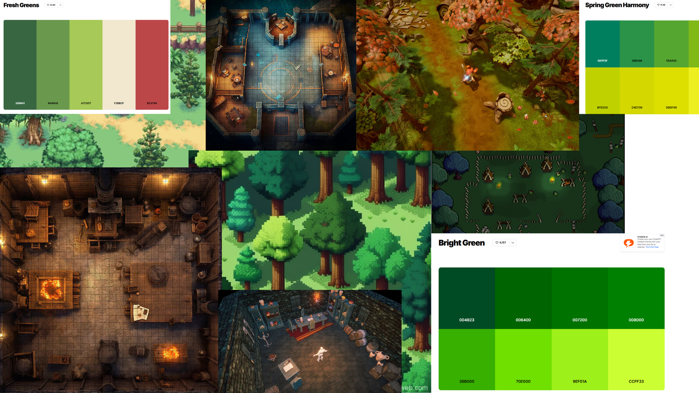
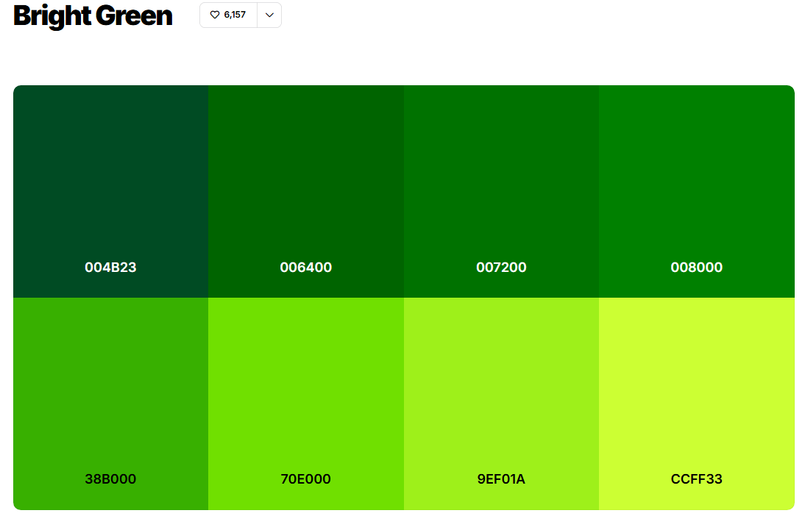
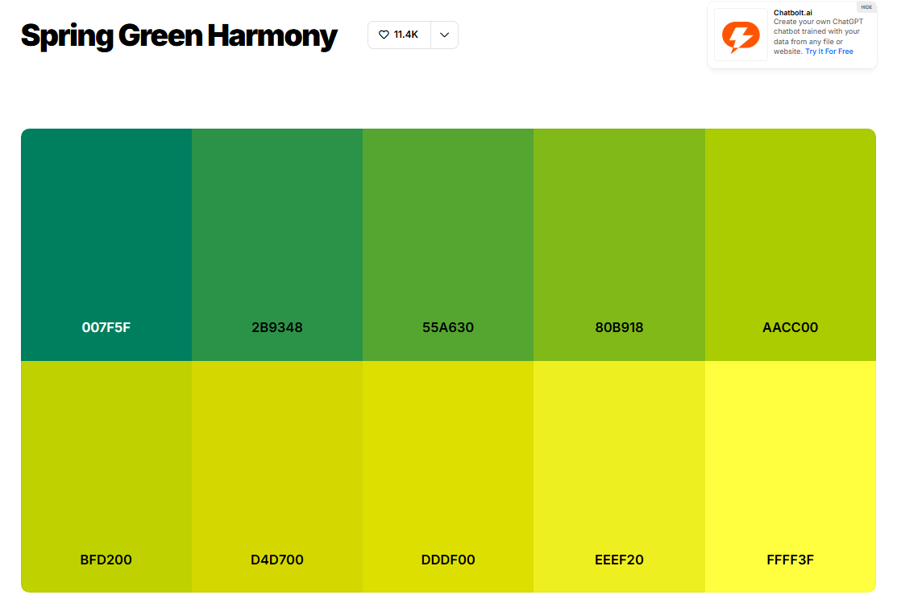

# concept_art_levels

## Nivel 1: Bosque Goblin – Ensamblado Básico

### Descripción Narrativa y Ambiental

* **Historia del Lugar:**  
  Este nivel se sitúa en el **Bosque Goblin**, un pequeño claro dentro de un bosque encantado donde los goblins realizan su primer entrenamiento de construcción. Aquí, los goblins aprenden a ensamblar piezas de madera siguiendo planos sencillos. El taller es rústico, improvisado con troncos, tablones y algunas herramientas básicas tiradas por el suelo. Se siente seguro y acogedor, sin peligros externos.

* **Sensaciones Clave:**  
  El jugador debe sentirse **tranquilo pero curioso**, motivado a experimentar con los controles y disfrutar de un entorno alegre, vibrante y amigable.

---

### Descripción Funcional (Gameplay)

* **Layout Básico / Blockout:**  

[Inicio jugador] → [Mesa de planos] → [Zona de ensamblaje] → [Área de materiales] → [Punto de validación / entrega]

Flujo simple, pensado para enseñar los controles y la dinámica de ensamblaje sin distracciones.

* **Puntos de Interés (POIs):**

1. Mesa de planos: lugar donde el jugador toma el diseño del estante.  
2. Área de materiales: pila de madera disponible para ensamblar.  
3. Zona de ensamblaje: espacio donde se arma el estante.  
4. Punto de validación: detector automático que confirma si el estante está correcto.

* **Interactividad:**

* Los jugadores pueden agarrar y soltar piezas de madera.  
* Colocar piezas en la zona de ensamblaje.  
* Activar el punto de validación para completar el nivel.

---

### Referencias Visuales y de Estilo

* **Moodboard del Nivel:**

* **Paleta de Colores:**

* Predominancia de **verdes vibrantes y marrones cálidos**.  
* Detalles en amarillo y rojo para props y señales, generando contraste visual.

* **Materialidad:**

* Madera pulida y rugosa.  
* Piedras pequeñas decorativas.  
* Tela o cuerda en algunas áreas del taller.

---

### 🪵 Lista de Props / Assets Requeridos

* Troncos y tablones de distintos tamaños.  
* Mesa de planos.  
* Caja de herramientas (martillos, clavos, sierras).  
* Barriles y sacos decorativos.  
* Señales de advertencia estilo goblin.  
* Plantas pequeñas, hongos y arbustos del bosque.  
* Suelo de tierra con detalles de césped.  
* Puntos de validación: placas o máquinas simples que “checkean” los estantes.

---
