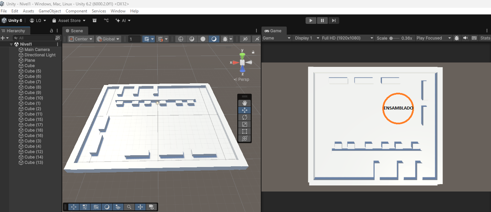

# Propuesta para el área de ensamblado

Propongo que el área de ensamblado sea una gran mesa, ya sea circular o cuadrada, con la cual todos los jugadores puedan interactuar para completar crafteos/construcciones/blueprints.

Propongo que mostremos por medio de UI todos los elementos necesarigos, por ejemplo, si nos piden construir un Molino de Viento, el área de Ensamblado mostrará el blueprint del Molino de Viento, como si fuera el objeto pero con un poco de transparencia, y conforme se vayan agregando piezas, se vaya reflejando en el blueprint de manera visual. También deberá indicar las piezas necesarias y las piezas ya agregadas, esto lo podrá ver cualquier jugador para que todos estén sincronizados y se logren comunicar entre ellos para terminar el blueprint.

Todos los jugadores deberán poder interactuar con el área de ensamblado simultáneamente, por lo que debemos de manejar muy bien la lógica del armado de objetos para evitar bugs de piezas duplicadas y demás.

Por último, propongo que el diseño de dicha área sea como de una Mesa de Crafteo, que vaya acorde al estilo visual que estamos manejando.

