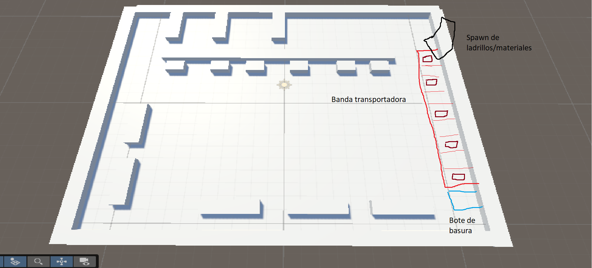

Propongo que la banda transportadora esté en un área accesible para todos los jugadores como se encuentra en la imagen

Propongo que los materiales caigan de un pequeño contenedor o campana desde el techo y caigan sobre la banda

Al final de la banda que haya un bote de basura para deshacerse de los materiales que lleguen hasta el final

Propongo que la banda nunca lleve más de 8 materiales a la vez.