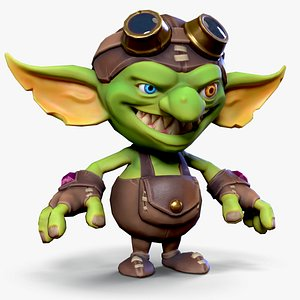

# Documento de Diseño de Videojuego (GDD)

## Introducción

**Título:** Gob's at Work

**Género:** Party, Cooperativo, Top Down

**Plataforma:** PC, Nintendo Switch

*Justificación:* Estas plataformas fueron seleccionadas por su enfoque en juegos multijugador locales y portabilidad, ideales para experiencias party cooperativas. Nintendo Switch y PC permiten jugar en grupo fácilmente y tienen una base de usuarios que disfruta este tipo de juegos.

**Versión:** TBD

**Sinopsis:**
Gob's at Work es un videojuego cooperativo local para hasta 4 jugadores, donde los participantes toman el rol de goblins que deben construir estantes para guardar monedas de oro, siguiendo diseños específicos bajo presión de tiempo y con recursos limitados. El juego combina trabajo en equipo, resolución de retos y diversión en una temática party.

**Alcance:**
Desarrollar un juego multijugador local con mecánicas de construcción, interacción entre personajes y objetos, sistema de puntuación por estrellas y niveles con diferentes retos. El objetivo es lograr una experiencia divertida y desafiante para grupos de amigos.

**Categoría:** Entretenimiento

**Licencia:** TBD

## Guion
TBD

## Mecánicas
- Multijugador local cooperativo para hasta 4 personas.
- Construcción de estantes siguiendo diseños.
- Uso de materiales: ladrillos, madera, metal según el nivel.
- Personajes pueden agarrar objetos, saltar y dar emojis.
- Interacción con objetos que pueden tener acciones específicas.
- Colisiones entre personajes.
- Tiempo limitado para completar cada estante.
- Sistema de puntuación de 3 estrellas basado en desempeño y tiempo.

## Interfaces
-Menu Incial
-Inicio de Juego
-Inicio de Nivel
-Fin de Nivel

## Niveles
TBD

## Progreso del juego
- El progreso se mide por la cantidad de diseños completados y estrellas obtenidas.
- Desbloqueo de nuevos niveles y retos al avanzar.
- Sistema de recompensas y logros por desempeño.

# ASASAS

## Personajes
### Información General

- **Nombre completo:**   No tienen
- **Alias o apodo:**  Gob
- **Edad:**  Indefinida
- **Raza/Especie:**  Goblins
- **Rol en la historia:** Personajes jugables 

---

### Jugabilidad

- **Habilidades básicas:**  
  - Moverse 
  - Agarrar objetos  
  - Modificar objetos 
  - Craftear objetos  
  - Desechar objetos
  - Vender objetos 
- **Estilo de juego:** Multijugador y con vista elevada   
- **limitaciones:**  El jugador solo podrá llevar un objeto a la vez

---

### Diseño Visual

- **Vestimenta:**  Usa un overol y un sombrero de copa
- **Elementos icónicos:** Su vestimenta y la antorcha que tiene en la mano derecha 
- **Referencias visuales:**  

- **Cambios visuales a lo largo del juego:**  Cada jugador tendrá su propio color al entrar al juego

---

### Requisitos Técnicos

- **Animaciones necesarias:**  
  - Idle  
  - Caminar  
  - Saltar
  - Agarrar objetos
  - Cargar objetos  
  - Colocar objetos  
- **Estados del personaje:**  
  - Idle  
  - Moviendo  
  - Saltando
  - Cargando objetos  
  - Colocando objetos  
  - Crafteando objetos 
- **Interacciones con entorno:**  Puede agarrar, colocar, modificar y craftear objetos para venderlos

---

