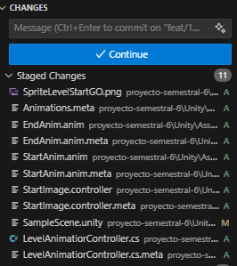

## Conflicts
Los conflictos suceden cuando una rama quiere hacer merge a main pero esta desactualizada.

Por ejemplo, si hay dos desarrolladores que estan trabajando con la misma version de main `1.0` pero uno termina antes, entonces main ya tiene otra version `1.1` para cuando el segundo haya resuelto las cosas ese desarrollador seguira con la version `1.0` en lugar de la `1.1` por lo que tiene que actualizar los cambios de `1.1` en su rama local.

Developer1
    [main 1.0] --> feat/1
    pull request --> approved
    merge  --> main[1.1]

Developer2
    [main 1.0] --> feat/2
    pull request --> approved
    request changes --> fix
    pull requset --> approved
    conflicts [1.0 vs 1.1] -> solve conflicts
    merge  --> main[1.2]


### Conflictos en el pull requests
Es facil detectar que mi Pull requests tiene conflictos, se ve hasta el final del Pull Request. Si notas que hay conflictos, no te esperes a que te digan que debes resolverlos. Hazlos en cuanto los veas.


## Como resolver conflictos?
Resolver conflictos no es complicado, y menos si se tienen herramientas, lo que se debe de entender son dos conceptos:

- Current: Tus cambios de tu rama
- Incoming: Los cambios de la rama que estas intentando mergear

Como queremos actualizar nuestra rama por que esta desactualizada, los conflictos generalmente seran:

- Current: mi rama local
- Incoming: la rama main

### VSCode
En seguida, se mostraran los pasos para resolver conflictos con VSCode y con la consola.

1. Estamos resolviendo nuestro ticket, actualmente ya hemos terminado, mi rama local tiene todo mi trabajo 
    ```powershell
        PS D:\Amerike\Proyecto Semestral\Repositorio\proyecto-semestral-6> git branch
        * feat/17-movimiento-jugadores-control
        main
    ```

2. Antes de hacer un `Pull Request` es bueno revisar si tengo conflictos, para eso, cambio a main y hago pull
    ```powershell
        PS D:\Amerike\Proyecto Semestral\Repositorio\proyecto-semestral-6> git switch main
        Switched to branch 'main'
        D       documentacion/desarrollo.md
        D       documentacion/pruebas_unitarias.md
        Your branch is up to date with 'origin/main'.
        PS D:\Amerike\Proyecto Semestral\Repositorio\proyecto-semestral-6> git pull
        Already up to date.
    ```

    Parece que mi rama `main` esta actualizada con `origin/main` significa que tiene la version mas actual. De no estarlo, con `git pull` ya se habria actualizado. Ahora, buscare hacer un merge de `main -> feat/17-movimiento-jugadores-control`

3. Regreso a mi rama donde esta mi trabajo, confirmo que estoy en esa rama
    ```powershell
        PS D:\Amerike\Proyecto Semestral\Repositorio\proyecto-semestral-6> git switch feat/17-movimiento-jugadores-control
        Switched to branch 'feat/17-movimiento-jugadores-control'
        D       documentacion/desarrollo.md
        D       documentacion/pruebas_unitarias.md
        Your branch is up to date with 'origin/feat/17-movimiento-jugadores-control'.
        PS D:\Amerike\Proyecto Semestral\Repositorio\proyecto-semestral-6> git branch
        * feat/17-movimiento-jugadores-control
        main
    ```

    El `*` indica en que rama estas actualmente.

4. Ya ubicado en mi rama, mergeo lo de main.
    ```powershell
        PS D:\Amerike\Proyecto Semestral\Repositorio\proyecto-semestral-6> git merge main
        Auto-merging Unity/Assets/Scenes/SampleScene.unity
        CONFLICT (content): Merge conflict in Unity/Assets/Scenes/SampleScene.unity
        Automatic merge failed; fix conflicts and then commit the result.
    ```

    Como puedo ver, tengo conflictos. Me esta pidiendo que los resuelva y luego haga commit. Para esto VSCode nos da una herramienta para hacerlo.

5. En el menu de VSCode, puedo ver que hay un plugin de git. Como ya tendre unos camibos, tendra unos numeros. Hago click en esa extension.

    

6. Vere que hay un registro de los cambios, los `Staged Changes` son los cambios en espera de ser registrados con un commit, los `Merge Changes` son los conflictos, a veces podre tener uno o muchos. Hago click sobre uno.

    

7. Me abrira el archivo y en un principio no sabre donde estan los conflictos, pero, `VSCode` tiene un editor para ayudarnos a visualizarlos. Esta ubicado abajo a la derecha, hago click en ese boton.

    

8. Abrira el editor de merge, en este debes enfocarte en las siguientes cosas:
    - La ventana superior izquierda es el `incoming` si tienes dudas de que rama es, ahi mismo te dira, en este caso es `refs/heads/main` es decir, lo mas actualizado de `main` donde `refs= origin/HEAD` es decir, lo mas actualizado de la rama main en github.
    - La ventana superior derecha es el `current` puedes ver que se esta haciendo referencia a `/feat/17-movimiento-jugadores-control` es decir, mi rama actual.
    - La ventana inferior es el `Result` es decir, lo que va a terminar teniendo el codigo despues de mergear.
    - `Result` musetra la opcion seleccionada, en cada ventana superior se mostraran los cambios, y en el resultado se mostrara lo que se escogio.
    - En cada ventana superior apareceran opciones como `Accept Current` o `Accept Incoming`.
    - En el slider de la derecha, hay unos bloques grises y amarillos, los bloques grises son las selecciones `Automaticas` que se pudieron hacer. Las selecciones `amarillas` son las que no se pudieron hacer de forma automatica.
 
    

9. Desplazate hasta el primer bloque amarillo.Ahi debes observar que ya hay diferencias, diferencias que `git` no supo escoger, por lo que necestia de tu ayuda. Aqui hay varias opciones:

    - Accept Incoming: Tomara la parte del codigo de incomming
    - Accept Combinacion: agregara ambas, con un orden en especifico
    - Accept Current: Tomara la parte del codigo de current

    

10. Escoge una opcion, ten en cuenta, que debemos darle prioridad a `main` pero abajo dejo las consideracionse.
    - Si Main tiene mas informacion, acepta lo de main.
    - Si tu rama tiene mas informacion que main, acepta lo tuyo (casi no pasara)
    - Si los conflictos son en archivos `.meta` acepta los de main

11. Repite el proceso para todos los puntos amarillos y darle click en `Complete Merge` vas a saber que no te falta nada si no te dice que aun quedan conflictos.

12. Una vez que hayas terminado, veras que el color del archivo pasara de rojo a amarillo.

    

13. Despues, haz un commit con todos los cambios actualizados, veras que ya no hay nada que falte en el menu de cambios de git.

    

14. Asegurate de agregar todos los cambios y hacer un commit, puedes ponerle algo como `(fix): merge main`

    ```powershell
        PS D:\Amerike\Proyecto Semestral\Repositorio\proyecto-semestral-6> git add .
        PS D:\Amerike\Proyecto Semestral\Repositorio\proyecto-semestral-6> git commit -m "(fix): merge main"
        [feat/17-movimiento-jugadores-control adba664] (fix): merge main
    ```

15. Una vez completado eso, puedes pushear y ya no tendras conflictos en github.
