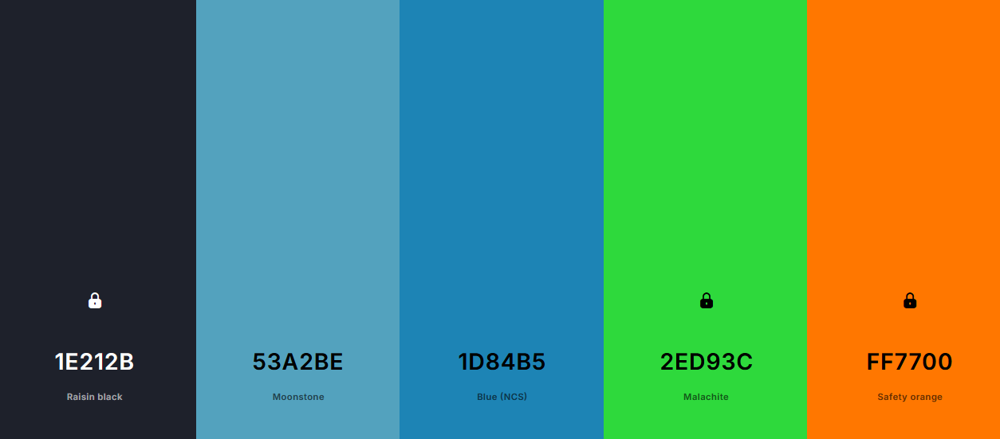
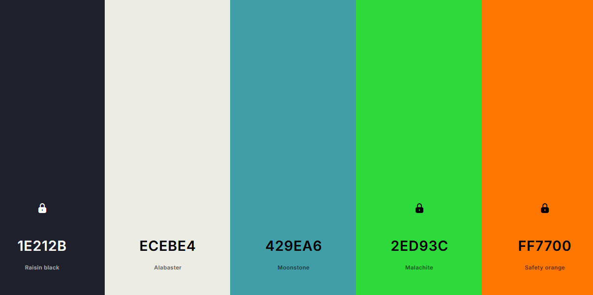
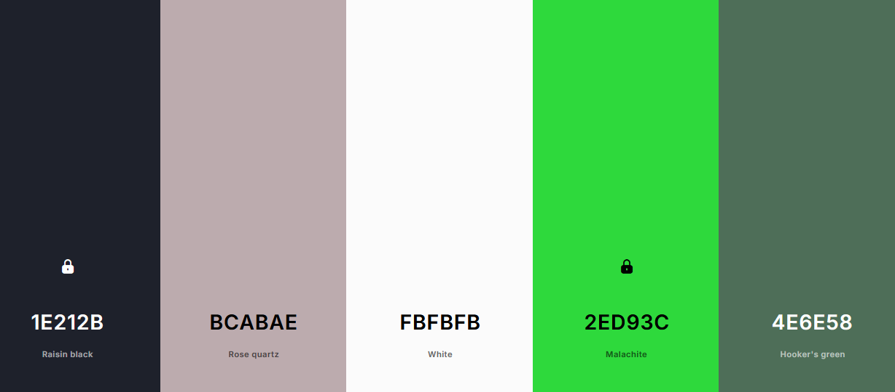
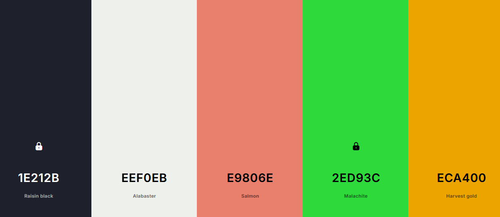
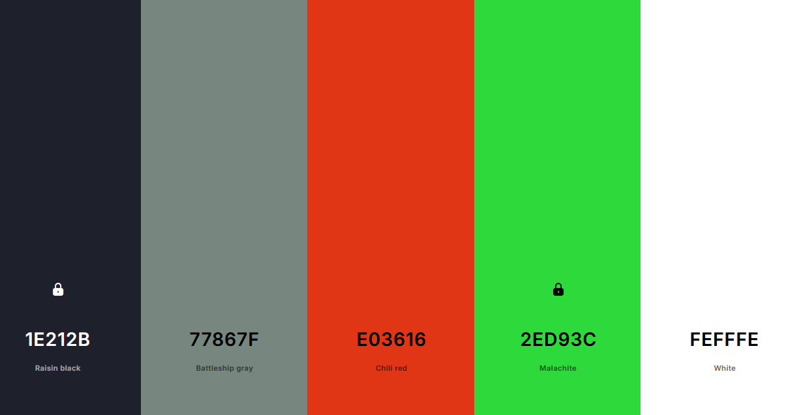

## Estilo Artistico

1. Modelado "Low Poly" o de formas simplificadas.
    - Modelado en 3D con apariencia y entornos facetados y ligeramentes abstractos.
2. Personajes expresivos y tiernos.
    - Proporciones exageradas, cabezas grandes y cuerpos pequeños.
    - Ojos grandes y expresivos.
    - Animaciones sencillas pero efectivas.
    - Personalidad amigable
3. Paleta de colores vibrantes y saturadas
    - Alto contraste, generar un mundo visualmente estimulante y alegre.
    - Uso de colores primarios.
    - Iluinacion suave y sombras minimas.
4. Entornos de diorama
    - Mundos compactos o en miniatura.
    - Vista top down.
    - Entornos simples y con detalles encantadores.

### Referencias Visuales
- Moving Out
- Lumberhill
- Good Job!
- Untitled Goose Game

## Paleta de colores
Opcion 1

Opcion 2

Opcion 3

Opcion 4

Opcion 5

